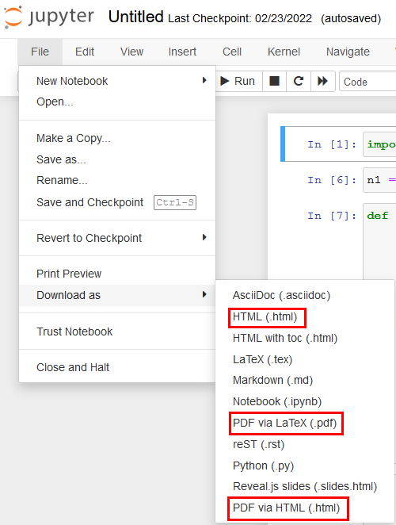

*Zbirka predlog za laboratorijske vaje pri predmetu*

# Procesiranje signalov

## Uvod

[](https://domengorjup.github.io/ps_lv/)

Tukaj najdete predloge laboratorijskih vaj pri predmetu [Procesiranje signalov](https://www.ladisk.si/?what=incfl&flnm=procesiranje%20signalov.php), ki se izvaja v letnem semestru 1. letnika Magistrskega študijskega programa na Fakulteti za Strojništvo v Ljubljani.

Predloge so pripravljene v obliki interaktivnih [Jupyter Notebook](https://jupyter.org/) dokumentov, katerih izvorna koda je prav tako objavljena in je namenjena pripravi in izvedbi laboratorijskih vaj.

```{admonition} Sodelovanje na vajah
:class: warning
Na laboratorijskih vajah se bomo ukvarjali z zajemom in obdelavo realnih signalov. Na vaje zato **pridite pripravljeni** tako, da vnaprej preštudirate predlogo vaje, ki se vsebinsko navezuje tudi na aktualno predavanje. Sodelovanje na vajah bomo preverjali s tedenskimi nalogami.
```


Poseben pomen v predlogah imajo označeni okvirčki, v katerih so zapisne:

```{note}
Dodatne koristne informacije v zvezi s snovjo. 
```

```{admonition} Naloga
:class: seealso
Naloge, ki jih bomo na vajah raziskali skupaj.
```

```{admonition} Naloga
:class: important
Naloge, ki jih boste na vajah reševali samostojno.
```

```{admonition} Preverjanje
:class: warning
Domače naloge in naloge, namenjene preverjanju sodelovanja na vajah.
```

## Ocena sprotnega dela na vajah

### [E-učilnica - Procesiranje signalov](https://e-ucilnica.fs.uni-lj.si/course/view.php?id=328)

Samovpis, geslo: `PRSMM-26`

### Domače naloge

(intro-domace-naloge)=
```{admonition} Domače naloge
:class: warning
Vsebina domačih nalog bo individualizirana, podatke za svojo nalogo najdete v [e-učilnici](https://e-ucilnica.fs.uni-lj.si/).

V skaldu z navodilom naloge pripravite **kratko** poročilo (od 3 do **maksimalno 10 celic s kodo**), v katerem najprej povzamete *zahteve naloge* ter *svoje podatke*. V poročilo vključite tako *kodo rešitve* kot *kratke komentarje* na nalogo (primerna oblika je npr. Jupyter Notebook).

**Dodatek:** Za možnost višje ocene sodelovanja na vajah bodite pozorni na predloge razširitve domače naloge.

**ODDAJA DOMAČIH NALOG** poteka preko e-učilnice. 

**Rok za oddajo** je *dan naslednjega predavanja pri predmetu*, če ni v nalogi definirano drugače.

Sistem omogoča oddajo več datotek. Če poročilo domače naloge pripravite v programskem okolju (npr. Jupyter Notebook), v e-učilnico oddajte **tudi poročilo v `.pdf` obliki**. 

Jupyter Notebook datoteko enostavno pretvorite v PDF `File -> Print Preview -> Print to PDF`.
```


```{admonition} Kriterij ocenjevanja domačih nalog
:class: warning
| <div style="width:65pt">Ocena [%]</div> | Komentar |
| ----- | -------- |
| < 50 | Na vajo niste ustrezno pripravljeni **in** minimalne zahteve naloge niso izpolnjene / poročilo ni ustrezno oddano. |
| < 60 | Na vajo niste ustrezno pripravljeni **ali** minimalne zahteve domače naloge niso izpolnjene. |
| (60, 70] | Osnovne zahteve naloge so izpolnjene s pomanjkljivostmi (npr. neustrezno predstavljeni podatki naloge, nepopolno opremljeni grafi, brez komentarja osnovnih ugotovitev...). |
| (70, 80] | Izpolnjene osnovne zahteve naloge, zadostno poročilo. |
| (80, 90] | Izpolnjene osnovne zahteve naloge, dodatna vsebina s pomanjkljivostmi (npr. pomankljivo interpretirani rezultati...). |
| (90, 100] | Ustrezno uporabljena, predstavljena in interpretirana dodatna vsebina. |

<br>

V primeru **zamude** se ocena domače naloge zniža (10% / dan).
```

### Seminar

(intro-seminar)=
```{admonition} Izbirni seminar
:class: warning

Del ocene sprotnega dela pridobite na podlagi neobveznega individualnega seminarja. Seminar pripravite na temo izbrane vsebine laboratorijskih vaj in predstavite v obliki 30-minutne predstavitve v rednem terminu laboratorijske vaje.

**Zahteve:**

- Predstavitev služi kot uvod v laboratorijsko vajo in mora biti dovolj podrobna, da omogoča samostojno izvedbo individualnega dela vaje.
- Seminar izvedete v okolju Jupyter Notebook z ustreznimi opisi teoretičnega ozadja metod ter praktičnimi primeri.
- Kot izhodišče lahko uporabite objavljeno predlogo laboratorijske vaje, obvezna pa je uporaba dodatnih ustrezno citiranih virov, primerov in literature.

**Kriteriji:**

Seminar se ocenjuje po naslednjih kriterijih z utežmi:

| Kriterij | Utež |
| -------- | ---- |
| Jasnost in strukturiranost predstavitve | 25% |
| Zanimivost in didaktična vrednost | 20% |
| Vsebinska pravilnost | 30% |
| Tehnična izvedba (Jupyter Notebook, primeri, citiranje) | 25% |  

<br>

**Ocenjevalna lestvica:**

| Ocena [%] | Komentar |
| --------- | -------- |
| < 50 | Predstavitev ne zadošča za izvedbo vaje **in** minimalne zahteve niso izpolnjene (manjkajoči viri, pomanjkljiv Jupyter Notebook). |
| < 60 | Predstavitev ne zadošča za izvedbo vaje **ali** minimalne zahteve niso izpolnjene (manjkajoči citati, nepopolna razlaga metod). |
| (60, 70] | Osnovne zahteve so izpolnjene s pomanjkljivostmi (npr. površna razlaga ozadja, primeri brez zadostnih komentarjev, pomanjkljivo citiranje). |
| (70, 80] | Izpolnjene osnovne zahteve, predstavitev zadošča za izvedbo vaje, ustrezno citiranje virov. |
| (80, 90] | Izpolnjene osnovne zahteve, dodatna vsebina (npr. primerjava metod, dodatni primeri) s pomanjkljivostmi v interpretaciji ali izvedbi. |
| (90, 100] | Odlična predstavitev z dodatno vsebino, primeri so ustrezno interpretirani, jasna didaktična vrednost, tehnično brezhibna izvedba. |  
  
<br>

V primeru, da se za seminar ne odločite, se pri izračunu končne ocene sodelovanja na vajah upošteva ocena $SN=0 %$.

V tednu, ko zagovarjate individualni seminar **z oceno vsaj 80%**, ta šteje tudi kot opravljena domača naloge. Namesto poročila domače naloge ta teden oddate samo PDF dokument s pojasnilom, da ste opravili individualni seminar.
```


## Vsebina

```{tableofcontents}
```
